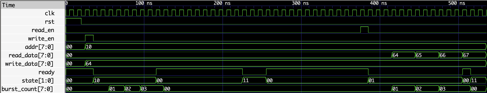
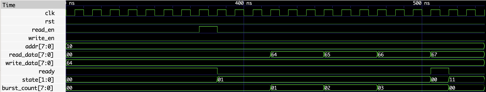

# Memory Controller Modeling DRAM-like Timing (SystemVerilog)

## Overview
This project implements a simplified memory controller in SystemVerilog to model key DRAM behaviors, including read/write latency, burst access, and periodic refresh cycles. The design demonstrates how memory access is scheduled and how timing constraints influence system-level behavior.

## Features
- FSM-based controller (IDLE / READ / WRITE / REFRESH)
- Configurable read and write latency parameters
- Burst transfer support for sequential memory access
- Refresh mechanism that temporarily blocks memory operations
- Functional verification through simulation and waveform analysis

## Key Concepts
- Memory access scheduling and arbitration
- Latency vs. throughput trade-offs
- DRAM-like timing behavior (simplified abstraction)

## Tools
- SystemVerilog
- Icarus Verilog
- GTKWave

## Project Structure
- `memory_controller.sv` — controller RTL with DRAM-like timing behavior
- `memory_controller_tb.sv` — testbench for write, read, burst, and refresh verification
- `waveform_full.png` — full simulation overview
- `waveform_zoom.png` — zoomed-in read burst and latency behavior

## Example Behavior
- Burst write stores sequential data across consecutive addresses
- Burst read retrieves data with defined latency before output
- Periodic refresh cycles temporarily block memory access

## Example Waveform

### Full System Behavior


Overall controller behavior including write, refresh, and read phases.

### Read Burst and Latency (Zoom-In)


Demonstrates read latency and burst transfer (64 → 67), along with state transitions.


## How to Run
Compile and simulate using Icarus Verilog:

```bash
iverilog -g2012 -o memory_controller_tb memory_controller.sv memory_controller_tb.sv
vvp memory_controller_tb
gtkwave memory_controller.vcd
